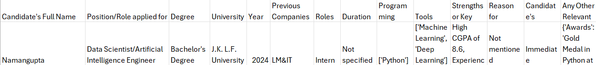

# Interview-Parser
This project is made to primarily streamline the interview process given that there are hundreds of applications for a single position and finding a good fit has become tougher.  
<B> Goal:</B> This model uses an interview's audio file and converts it into a CSV file that contains meaningful insights that might be useful for a company's hiring process.  
<h4>Working</h4>
Our model uses OpenAI's Whisper model to convert audio into text. This transcribed text is then fed to gpt-3.5-turbo which extracts candidate's info based on the prompts provided to it. Some of the data extracted includes candidate's Name, degree, skills, work experience, availability and many more. Not limiting our model to just information extraction, we have also included a relevance score. This is the measure of candidate's relevance to a company's job requirements. At last, all the data gets stored in a CSV file.  

